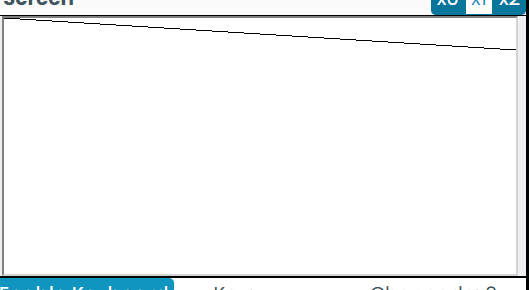
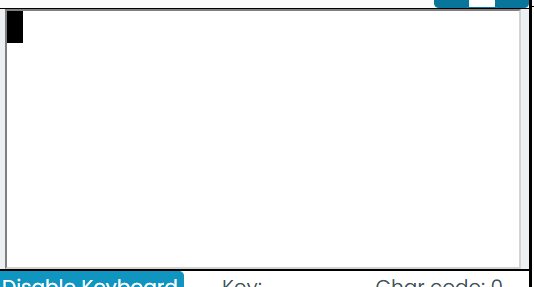
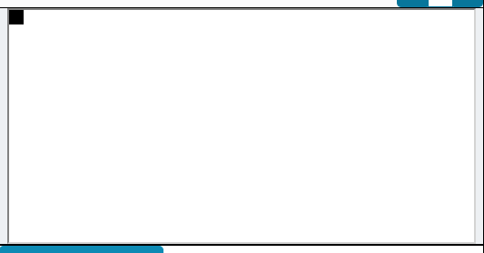
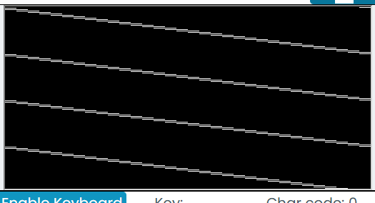

# Ejercicio 3

## Primer experimento

el primer objetivo es hacer un cuadrado de 32*32 bits completamente negro al pulsar la tecla A

la idea es primero hacer un bucle infinito del que solo se alga al pulsar la tecla A
luego que este te envie a un bucle que se repita 32 veces y que haya otro bucle adentro que pinte los cuadros del 0 al 32

Ya se han hecho los dos bucles para poder pintar el cuadrado para pasar a la siguiente linea se ponian en escalera, entonces se vio que en lugar de sumar 32 se debia de sumar 31 ahi se arregló pero ya no era un cuadrado si no un rectangulo entonces se redujo el numero de veces en el que se hacia el segundo bucle a la mitad para conseguir el cuadrado 

**ESCALERA**

**RECTANGULO**

**RESULTADO ESPERADO**

## CONCLUSION 

Se obtuvo el resultado esperado 

## Segundo experimento 

se quiere hacer una serie de x's completo toda la pantalla, para lo cual se necesitan bucles dobles uno para cada sentido; 

se logro hacer las x's pero habia un error al intentar asignar a la variable d=-1 se estaba haciendo con el registro lo que hacia que se atrofiara un poco el codigo y se le estaba sumando 1 a la variable para interactuar con las lineas y por eso daba algo extrañas las x que no se asignaban correctamente pero luego se arreglo ese error y se formo en pantalla algo completemente inesperado

**Resultado inesperado**

lo que creo que esta pasando es que los bucles que tenia de alguna manera con el error se sobreecribia los valores que se debian hacer, por lo que se ve en la ejecucion va como pintando con el primer bucle con lineas dejando un espacion en blanco y ese espacio con el segundo bucle lo rellena dejando solamente el que se ve en la imagen 

## conclusion

no se obtuvo el resultado esperado pero antes de corregir el error se estaba obteniendo un resultado similar al esperado, al corregir el error se creo que se estaban ejecutanbdo las cosas mas de la cantidad de veces que debian ser en si.
